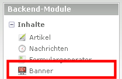
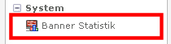

## Backend

### Banner

Das Banner Modul ist unter Inhalte -> Banner zu finden.

### Bannerstatistik

Das Bannerstatistik Modul ist unter System -> Bannerstatistik zu finden.

Es zeigt dann die Statistiken für die angelegten Banner in der jeweiligen Kategorie.
Hat man mehrere angelegt, z.B. für eine Multidomain Installation, kann die
Kategorie ausgewählt werden.

Eine Auswahl der Statistiken:

 TODO

 TODO
