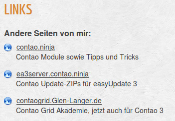

## Einsatz von Textbanner als Linkliste

Wer eine Linkliste benötigt und die Klicks auf diese Links zählen möchte,
kann dafür die Textbanner benutzen.

Beispiel wie das aussehen könnte:



Im Bild zu sehen ist die erste Zeile die Zieldomain und ist verlinkt.
In der zweiten Zeile die Erläuterung zu dem Link.


### Definition der Links

Am Besten wird dazu eine eigenen Kategorie angelegt, so können die Textbanner
für die Linkliste von den normalen Bannern getrennt verwaltet werden.

Folgende Definitionen sind bei den Bannern einzutragen:

* Bannername
  * Eindeutiger Name für den Link, z.B. "acme.de"
* Bannerziel-URL
  * Hier die Linkadresse eintragen, z.B. "http://acme.de"
* Bannerkommentar
  * Hier den Inhalt eintragen für die zweite Zeile wie im Bild zu sehen.

Das war es für das Erste. Das allein reicht jedoch nicht, das Template muss
noch angepasst werden.


### Template anpassen

Dazu wurde das Template "mod_banner_list_all.html5" auf den Textbanner Anteil
reduziert und angepasst (z.B. die Grafik am Anfang der einzelnen Links)

Hier das geänderte Template. Das wurde als "mod_banner_list_linkliste.html5"
über das Backend in Templates wie üblich abgelegt.

```html
<!-- indexer::stop -->
<section class="<?php echo $this->class; ?>"<?php echo $this->cssID; ?><?php if ($this->style): ?> style="<?php echo $this->style; ?>"<?php endif; ?>>
<?php if ($this->headline): ?>
<<?php echo $this->hl; ?>><?php echo $this->headline; ?></<?php echo $this->hl; ?>>
<?php endif; ?>
<?php foreach ($this->banners as $banner): ?>
<?php if ($banner['banner_text']) : ?>
    <div style="margin-bottom: 1em;" class="banner_text" id="banner_<?php echo $banner['banner_id']; ?>">
    	<div class="banner_text_name"><?php if ($banner['banner_url']): ?>
    		
			<a href="system/modules/banner/public/conban_clicks.php?<?php echo $banner['banner_key'].$banner['banner_id']; ?>" <?php echo $banner['banner_target']; ?> title="<?php echo $banner['banner_name']; ?>" ><?php endif; ?><?php echo $banner['banner_name']; ?><?php if ($banner['banner_url']): ?></a><?php endif; ?>
		</div>
    	<div class="banner_text_comment" style="padding-left: 24px;"><?php echo $banner['banner_comment']; ?></div>
    </div>
<?php endif; ?>
<?php if ($banner['banner_empty']) : ?>
	<div class="banner_empty">
	<!-- <?php echo $banner['banner_name']; ?> -->
	</div>
<?php endif; ?>
<?php endforeach; ?>
</section>
<!-- indexer::continue -->
```

> **Note** Die Datei "files/weblink.png" durch eine eigene Bilddatei ersetzen.

Download des Templates: [mod_banner_list_linklist.html.zip][1]


### Frontend Modul

Das Frontendmodul wird wie beschrieben angelegt, Besonderheiten hier sind dann:

* Überschrift
  * Hier kann eine Überschrift eingetragen werden, im Beispielbild wurde dort eingetragen:<br>
  "Andere Seiten von mir:"
* Bannerkategorien
  * Hier wird die Kategorie ausgewählt die man für die Linkliste angelegt hat
* Bannervorlage
  * hier das geänderte Template auswählen (mod_banner_list_linkliste)

Als Elementyp "Modul" dann im Artikel einbauen. Das "Links" im Bild ist noch ein
extra Überschrift Element im Artikel.


[1]: https://contao.ninja/banner_modul.html?file=files/module/mod_banner_list_linklist.html5.zip
