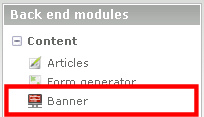
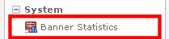

## Back end

### Banner

The Banner module can be found under Content -> Banner.

### Banner Statistics

The Banner Statistics module can be found under System -> Banner Statistics

It shows the statistics for the created banner. If you have created multiple
categories, for a multi domain installation, the category can be selected.

A selection of the statistics:

 TODO

 TODO
