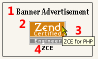
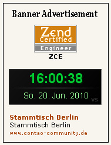

## Front end

For the front end are included one CSS file as an example of a display format:

* mod_banner_fe.css

This file is in the subdirectory `assets`. For use see [CSS-Datei](../04-using/04-demo-css-file.md)

### Display a banner

1. Module Headline
2. Banner Image
3. Banner Comment
4. Banner Name

More details about this see under [Using](../04-using/README.md) or [Technical Details](../05-technical-details/README.md).

### Display all Banner

With 'all Banner' is meant here, all banners in the selected category.

In this example, 3 banners have been defined,

1. Graphic Banner
2. Flash Banner
3. Text Banner

More details about this see under [Using](../04-using/README.md) or [Technical Details](../05-technical-details/README.md).

**Note**: The extension for Contao 4 will not support Flash banner.
