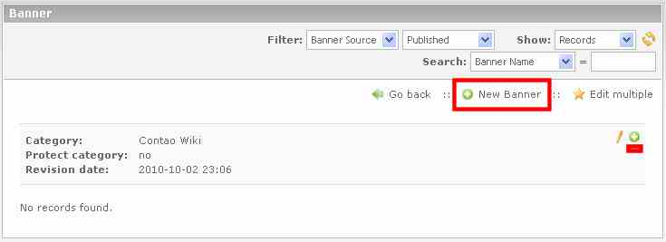

## Create new banner

In the category list now clicking on Edit (pencil) of the category.
Now, either click the 'New Banner' and then the arrow icon, or click the plus in the head of the category:

First, they must select the banner source:

* internal Banner (Graphic / Flash files is stored on server)
* external Banner (Graphic / Flash files are integrated via URL)
* Text Banner

After selecting it appear the appropriate form fields.

### Graphic Banners

1. Banner Name
    * The banner name will be displayed in the Banner overview and in the provided template appears below the banner graphic.
2. Banner weighting
    * This controls the display frequency of the banners. The higher the priority, the more often this banner is displayed.
3. Banner target URL
    * The URL of the target by clicking on the banner graphic. The input must include "http://".
    * Optional field.
    * Without a URL, the banner will be displayed without a link.
    * Alternative can be selected an internal target (Banner target page)
4. Banner Image
    * Here you can now select the banner file.
5. Banner width and height
    * To customize the banner size, you can specify the banner width and / or the banner height in pixels.
    * CAUTION: Animated GIFs are for size definitions through the GD recalculation unfortunately to still images.
6. Banner Comment
    * The first line will be installed and displayed as a "title" tag in the HTML source code if you move the cursor over the banner graphic.
7. Published
    * If this option is not selected, this banner is not displayed.

### Flash Banner

1. Banner Name
    * The banner name will be displayed only in the Banner overview.
2. Banner weighting
    * This controls the display frequency of the banners. The higher the priority, the more often this banner is displayed.
3. Banner target URL
    * The URL of the target by clicking on the Flash Banner. The input must include "http://".
    * Optional field.
    * Without a URL, the Flash Banner will be displayed without a link.
    * Alternative can be selected an internal target (Banner target page)
4. Banner Image
    * Here you can now select the banner file.
5. Banner width and height
    * To customize the banner size, you can specify the banner width and / or the banner height in pixels.
6. Banner Comment
    * Input is not necessary, is not used in the front end
7. Published
    * If this option is not selected, this banner is not displayed.

A flash fallback to an image file is available, see the section [Technical Details][1]

### Text Banner

1. Banner Name
    * The banner name will be displayed in the Banner overview and in the provided template as a headline that is linked simultaneously with the target URL.
2. Banner weighting
    * This controls the display frequency of the banners. The higher the priority, the more often this banner is displayed.
3. Banner target URL
    * The URL of the target by clicking. The input must include "http://".
    * Optional field.
    * Without a URL, the Text Banner will be displayed without a link.
    * in provided template only the domain is shown as a short form. (Third row, see picture above)
4. Banner Comment
    * This is the text line. (Second row, see picture above)
5. Published
    * If this option is not selected, this banner is not displayed.

Then you click on "Save and close".

[1]: ../05-technical-details/02-technical-details-banner-definition.md#flash-fallback-image
