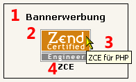
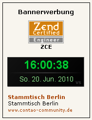

## Frontend

Für das Frontend wird eine CSS-Datei als Beispiel für eine Anzeigeformatierung mitgeliefert:

* mod_banner_fe.css

Diese Datei liegt im Unterverzeichnis `Resources/public`. Zur Verwendung siehe [CSS-Datei][1]

### Anzeige eines Banners

1. Modul Überschrift
2. Banner Bild
3. Banner Kommentar
4. Banner Name

Genaueres dazu siehe bei [Erste Schritte][2] oder [Feinheiten][3]

### Anzeige alle Banner

Mit 'alle Banner' ist hier gemeint, alle Banner der gewählten Kategorie.

In diesem Beispiel sind 3 Banner definiert worden,

1. einmal Grafik
2. ~~einmal Flash~~ (siehe unten)
3. einmal ein Text Banner.

Genaueres dazu siehe bei [Erste Schritte][2] oder [Feinheiten][3]

**Achtung**: Banner Bundle für Contao 4 unterstützt keine Flash Banner mehr.

[1]: ../04-erste-schritte/04-demo-css-datei.md
[2]: ../04-erste-schritte/README.md
[3]: ../05-feinheiten/README.md
