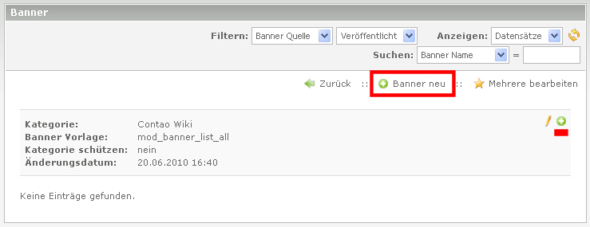

## Anlegen der Banner

Aus der Kategorie Übersicht klickt man nun auf Edit (Bleistift) der Kategorie.
Dort entweder auf 'Banner neu' und dann das Pfeil Symbol oder auf das Plus im
Kopf der Kategorie:

Als erstes muss nun die Banner Quelle gewählt werden:

* interner Banner (Grafik Dateien liegen auf dem Server)
* externer Banner (Grafik Dateien werden über URL eingebunden)
* Text Banner

Bei der Auswahl kommen die entsprechenden passenden Formularfelder dafür.

### Grafik Banner

1. Banner Name
    * Der Banner Name wird in der Banner Übersicht angezeigt und im
    mitgelieferten Template unterhalb der Banner Grafik angezeigt.
2. Banner Gewichtung
    * Damit kann die Häufigkeit der Anzeige gesteuert werden. Je höher die
    Gewichtung desto häufiger wird dieser Banner angezeigt.
3. Banner Ziel URL
    * Die URL des Zieles bei Klick auf die Banner Grafik. Die Eingabe muss
    inklusive http:// erfolgen.
    * Kein Pflichtfeld.
    * Ohne URL wird die Banner Grafik ohne Verlinkung angezeigt.
    * Alternative kann auch ein internes Ziel ausgewählt werden (Banner Ziel Seite )
4. Banner Datei
    * Hier kann nun die Datei ausgewählt werden.
5. Banner Breite und Höhe sowie der Skalierungsmodus
    * Um die Bannergröße anzupassen, kann man hier die Bannerbreite und/oder die
    Bannerhöhe in Pixel angeben.
    * **ACHTUNG:** Animierte GIFs werden bei Größen-Angaben durch die
    GD-Neuberechnung leider zum Standbild.
6. Banner Kommentar
    * Die erste Zeile wird als "title" Tag im HTML Quellcode eingebaut und
    angezeigt, wenn man den Mauszeiger über die Banner Grafik bewegt.
7. Domain Filter
    * Mit Angabe einer Domain, wird dieser Banner nur für diese Domain genutzt.
8. CSS-ID/Klasse
    * ID und beliebig viele Klassen für das Wrapper Element.
    Ein Präfix "banner_" wird automatisch hinzugefügt.
9. Veröffentlicht
    * Solange diese Option nicht aktiviert ist, wird dieser Banner nicht für
    die Anzeige berücksichtigt.
10. Begrenzung der Views und Klicks
    * Definition maximale View und/oder Klicks

### Text Banner

1. Banner Name
    * Der Banner Name wird in der Banner Übersicht angezeigt und im
    mitgelieferten Template als Überschrift, die gleichzeitig mit der Ziel URL
    verlinkt wird.
2. Banner Gewichtung
    * Damit kann die Häufigkeit der Anzeige gesteuert werden. Je höher die
    Gewichtung desto häufiger wird dieser Banner angezeigt.
4. Banner Ziel URL
    * Die URL des Zieles bei Klick. Die Eingabe muss inklusive http:// erfolgen.
    Kein Pflichtfeld.
    * Ohne URL wird der Banner ohne Verlinkung angezeigt.
    * Im mitgelieferten Template wird nur die Domain als Kurzform angezeigt.
    (3. Zeile, siehe Bild weiter oben)
5. Banner Kommentar
    * Dies wird die Textzeile. (2. Zeile, siehe Bild weiter oben)
6. Domain Filter
    * Mit Angabe einer Domain, wird dieser Banner nur für diese Domain genutzt.
7. CSS-ID/Klasse
    * ID und beliebig viele Klassen für das Wrapper Element.
    Ein Präfix "banner_" wird automatisch hinzugefügt.
8. Veröffentlicht
    * Solange diese Option nicht aktiviert ist, wird dieser Banner nicht für
    die Anzeige berücksichtigt.
9. Begrenzung der Views und Klicks
    * Definition maximale View und/oder Klicks
