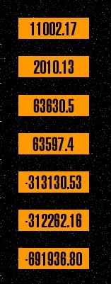

# Überblick

Das Star Trek® Stardate Bundle, ist eine Erweiterung welche die 
Sternzeit nach 7 unterschiedlichen Arten berechnen kann.

Dafür gibt es [Insert-Tags][1] und zum Test auch ein eigenes Content-Element.

## Hilfreiche Links

Information | Link
----------- | ----
Entwickler Webseite | [http://contao.ninja][2]
Link zum Extension Repository (Packagist) | [Packagist.org][3]
Den Entwickler unterstützen | [Amazon Wunschliste][4]
Fehler / Wünsche melden | [GitHub][5]
Contao Forum für Fragen | [community.contao.org][6]

## Übersetzungen

Die Übersetzungen der Texte vom Stardate Bundle im Backend werden mit 
Transifex verwaltet. Um eine neue Übersetzung erstellen oder um eine vorhandene 
zu korrigieren, müssen Sie sich bei transifex.com registrieren. 
Basissprache ist Englisch.

Projekt Link: [https://www.transifex.com/projects/p/contao-stardate-bundle/][7]

Howto (english): [http://docs.transifex.com/faq/#translating][8]

[1]: ../04-insert-tags/README.md
[2]: http://contao.ninja
[3]: https://packagist.org/packages/bugbuster/contao-stardate-bundle
[4]: http://www.amazon.de/wishlist/26HHEJOU03G76
[5]: https://github.com/BugBuster1701/contao-stardate-bundle/issues
[6]: https://community.contao.org/de/forumdisplay.php?119-Sonstige-Erweiterungen
[7]: https://www.transifex.com/projects/p/contao-stardate-bundle/
[8]: http://docs.transifex.com/faq/#translating
