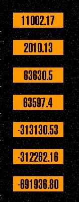

# Overview

The Star Trek® Stardate Bundle, is an extension which allows the Stardate can be calculated in 7 different ways.

For this there are [Insert-Tags][1] and a separate content element for testing.

## Helpful links

Information | Link
----------- | ----
Developer Website | [http://contao.ninja][2]
Link to Extension Repository (Packagist) | [Packagist.org][3]
Donate the developer | [Amazon Wunschliste][4]
Report Issues / Feature Requests | [GitHub][5]
Contao forum for questions | [community.contao.org][6]

## Translations

Translations of the texts in the Backend and the frontend  are managed with using of Transifex. 
To create a new translation or to help to maintain an existing one, please register at transifex.com.

Project Link: [https://www.transifex.com/projects/p/contao-stardate-bundle/][7]

Howto (english): [http://docs.transifex.com/faq/#translating][8]

[1]: ../04-insert-tags/README.md
[2]: http://contao.ninja
[3]: https://packagist.org/packages/bugbuster/contao-stardate-bundle
[4]: http://www.amazon.de/wishlist/26HHEJOU03G76
[5]: https://github.com/BugBuster1701/contao-stardate-bundle/issues
[6]: https://community.contao.org/de/forumdisplay.php?119-Sonstige-Erweiterungen
[7]: https://www.transifex.com/projects/p/contao-stardate-bundle/
[8]: http://docs.transifex.com/faq/#translating
