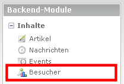
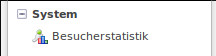
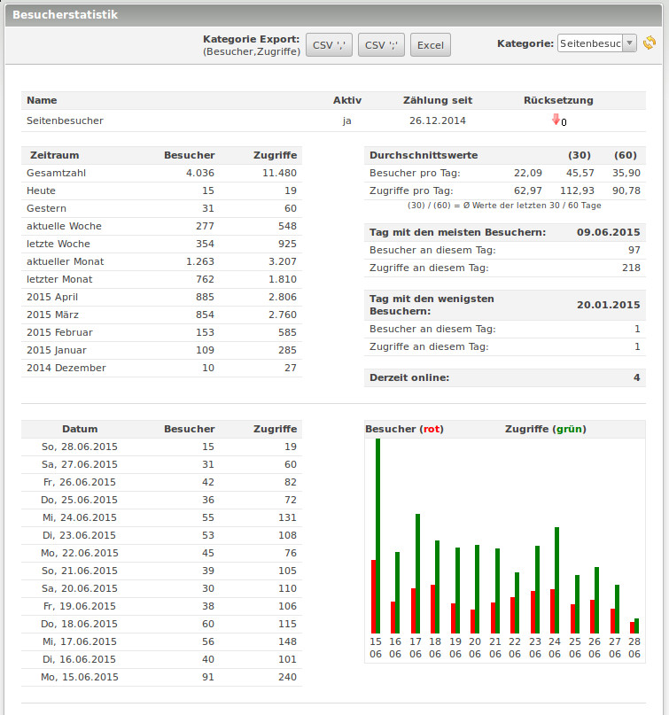
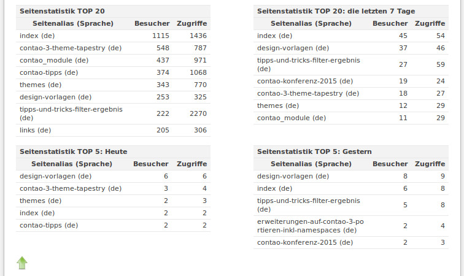

## Backend

### Besucher

Das Besucher Modul ist unter Inhalte -> Besucher zu finden.

### Besucherstatistik

Das Besucherstatistik Modul ist unter System -> Besucherstatistik zu finden.

Es zeigt dann die Statistiken für den angelegten Besucherzähler. Hat man mehrere angelegt, z.B. für eine Multidomain Installation, kann der Besucherzähler ausgewählt werden.

Eine Auswahl der Statistiken:

(TOP 20 Listen sind gekürzt.)
