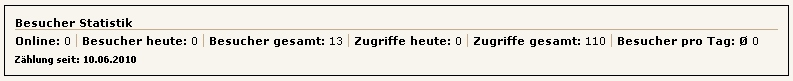

## Frontend

Für das Frontend werden zwei CSS-Dateien als Beispiel für eine Anzeigeformatierung mitgeliefert:

* mod_visitors_fe.css für die normale, zeilenweise Ausgabe
* mod_visitors_fe_horizontal.css für die horizontale Ausgabe

Diese Dateien liegen im Unterverzeichnis `css_demo`. Zur Verwendung siehe [CSS-Datei](../04-erste-schritte/04-demo-css-datei.md)

### Besucherstatistik zeilenweise

### Besucherstatistik horizontal

