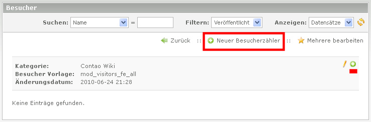

## Anlegen des Besucherzählers

In der Kategorie Übersicht kann durch ein Klick auf Edit (Bleistift) der Kategorie ein neuer Besucherzähler angelegt werden. Dort entweder auf 'Neuer Besucherzähler' und dann das Pfeil-Symbol oder auf das Plus im Kopf der Kategorie:

Nun sind einige Angaben nötig:

* Namen angeben (wird über den Zahlen als Überschrift angezeigt).
* Start-Datum, ist optional, dient nur zur Anzeige im Frontend
* Optional: 'Startwerte für Zähler' eingeben
* Optional: 'Besucher pro Tag' Anzeige aktivieren
* "Veröffentlicht" aktivieren

anschließend ein Klick auf "Speichern und Schließen".

