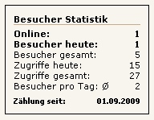

# Überblick

Visitors Bundle, im weiterem kurz Visitors, ist eine Erweiterung welche die 
Zugriffe (Hits) und Besucher (Visits) zählt und zur Anzeige bringen kann. 
Im Backend gibt es eine Statistikübersicht.

Dabei wird in der Anzeige getrennt angezeigt die Zugriffe/Besucher vom aktuellem 
Tag sowie die jeweilige Gesamtzahl.

Der Zugriffszähler wird, wie der Name schon sagt, bei jedem Zugriff erhöht. 
Der Besucherzähler zeigt die Zahl der unterschiedlichen IP-Adressen, die 
innerhalb von 30 Minuten eine oder mehrere Seiten angefordert haben auf dem sich 
die Erweiterung befindet. (siehe dazu auch [Blockzeit][1])

Visitors benutzt in Abhängigkeit die Erweiterung "BotDetection Bundle". 
Damit wird verhindert, dass Zugriffe von Bots / Suchmaschinen gezählt werden. 
Eine 100%ige Sicherheit gibt es dabei natürlich nicht.

## Hilfreiche Links

Information | Link
----------- | ----
Entwickler Webseite | [http://contao.ninja][2]
Link zum Extension Repository (Packagist) | [Packagist.org][3]
Den Entwickler unterstützen | [Amazon Wunschliste][4]
Fehler / Wünsche melden | [GitHub][5]
Contao Forum für Fragen | [community.contao.org][6]

## Übersetzungen

Die Übersetzungen der Texte von Visitors im Backend und Frontend werden mit 
Transifex verwaltet. Um eine neue Übersetzung erstellen oder um eine vorhandene 
zu korrigieren, müssen Sie sich bei transifex.com registrieren. 
Basissprache ist Englisch.

Projekt Link: [https://www.transifex.com/projects/p/contao-visitors-bundle/][7]

Howto (english): [http://docs.transifex.com/faq/#translating][8]

[1]: ../05-feinheiten/02-feinheiten-besucherzaehler-definition.md
[2]: http://contao.ninja
[3]: https://packagist.org/packages/bugbuster/contao-visitors-bundle
[4]: http://www.amazon.de/wishlist/26HHEJOU03G76
[5]: https://github.com/BugBuster1701/contao-visitors-bundle/issues
[6]: https://community.contao.org/de/forumdisplay.php?28-visitors
[7]: https://www.transifex.com/projects/p/contao-visitors-bundle/
[8]: http://docs.transifex.com/faq/#translating
