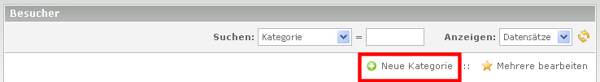

## Anlegen einer Kategorie

Um eine neue Besucher-Kategorie zu erstellen, wird im Backend unter Inhalte -> Besucher im Hauptbereich der Link 'Neue Kategorie' ausgewählt.

Am Anfang reicht es einen Kategorie-Namen anzugeben, anschließend ein Klick auf 
"Speichern und Schließen". Nun wird die Kategorie Übersicht angezeigt. 
Durch Klick auf den Bleistift in der Zeile der Kategorie und nochmaligem Klick 
auf den Bleistift im Kopf der Kategorie gelangt man wieder zu den Einstellungen 
der Kategorie.
