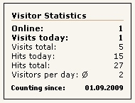

# Overview

This extension allows you to count hits and visits of your website.

In the display appears the hits and visits from the current day, as well as the
respective total. In the backend there are a statistic overview.

Visitors Bundle used the extension "BotDetection Bundle".
This prevents counting of traffic from bots / search engines.
But there is no 100% guarantee.

## Helpful links

Information | Link
----------- | ----
Developer Website | [http://contao.ninja][1]
Link to Extension Repository (Packagist) | [Packagist.org][2]
Donate the developer | [Amazon wish list (german)][3]
Report Issues / Feature Requests | [GitHub][4]
Contao forum for questions | [community.contao.org][5]

## Translations

Translations of the texts in the Backend and the frontend  are managed with using of Transifex.
To create a new translation or to help to maintain an existing one, please register at transifex.com.

Projekt Link: [https://www.transifex.com/projects/p/contao-visitors/][6]

Howto (english): [http://docs.transifex.com/faq/#translating][7]

[1]: http://contao.ninja
[2]: https://packagist.org/packages/bugbuster/contao-visitors-bundle
[3]: http://www.amazon.de/wishlist/26HHEJOU03G76
[4]: https://github.com/BugBuster1701/contao-visitors-bundle/issues
[5]: https://community.contao.org/en/forumdisplay.php?143
[6]: https://www.transifex.com/projects/p/contao-visitors-bundle/
[7]: http://docs.transifex.com/faq/#translating
