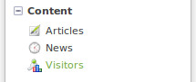
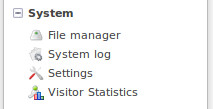
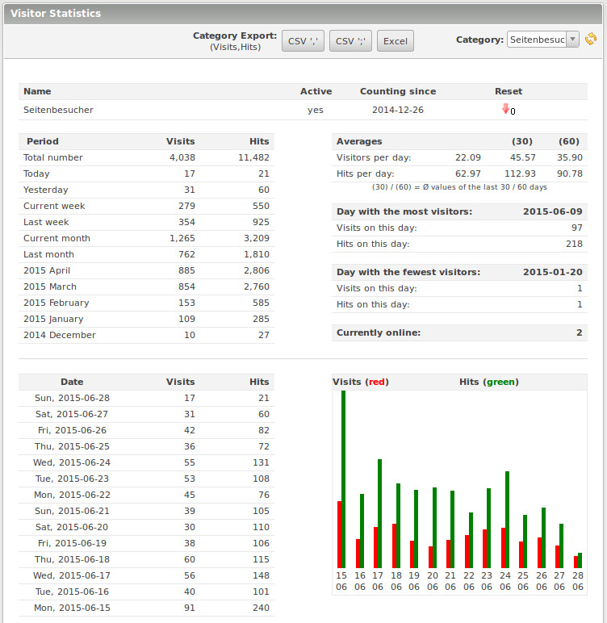
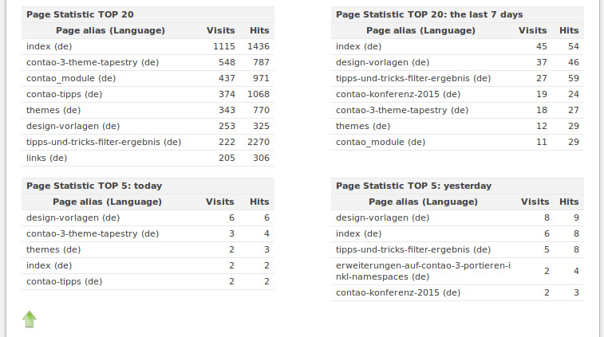

## Back end

### Visitors

The Visitors module can be found under Content -> Visitor.

### Visitor Statistics

The Visitor Statistics module can be found under System -> Visitor Statistics

It shows the statistics for the created counter. If you have created multiple 
counters, for a multi domain installation, the counter can be selected.

A selection of the statistics:

(TOP 20 lists are shortened.)
