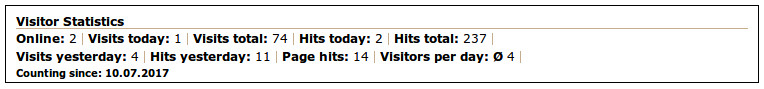

## Front end

For the front end are included two CSS files as an example of a display format:

* mod_visitors_fe.css for the normal output, line by line
* mod_visitors_fe_horizontal.css for the horizontal output

### Visitors Statistics line by line
View when using the template mod_visitors_fe_all:

### Visitors Statistics horizontal output
View when using the template mod_visitors_fe_all:

