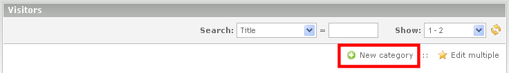

## Create the category

To create a new category, just click on the left in the back end in 'Content' on 
'Visitors'. In the main area click on the button 'New category'.

There, enter the name of the category. The front end module will later use this 
name. Then you click on "Save and close". 
Now you can see the category overview. By clicking on the pencil in the line of 
the category and repeated clicking on the pencil in the head of the category you 
return to the settings of the category.
