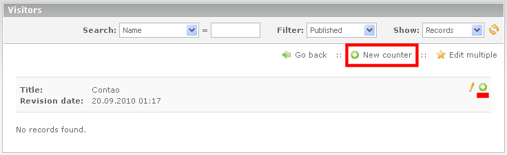

## Create new counter

In the category list now clicking on Edit (pencil) of the category. 
Now, either click the 'New counter' and then the arrow icon, or click the plus in the head of the category: 

Now, some information will be required:

* Name, (is displayed as a heading on the numbers).
* Start date, optional, only for display in font end
* Optional: 'Initial value of visitors/hits'
* Optional: 'Visitors per day'
* Activate "Published"

Then you click on "Save and close".
