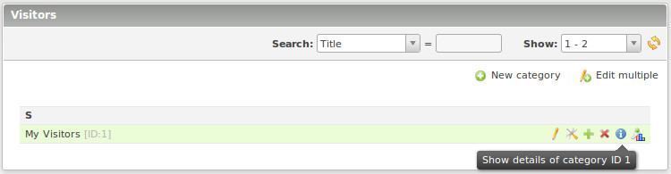

## Show the values
```
	 {{visitors::catid::name}}
	 {{visitors::catid::online}}
	 {{visitors::catid::start}}
	 {{visitors::catid::totalvisit}}
	 {{visitors::catid::totalhit}}
	 {{visitors::catid::todayvisit}}
	 {{visitors::catid::todayhit}}
	 {{visitors::catid::averagevisits}}
```
Insert Tag  can be extended with prefix 'cache_'. Thus, these then cache resistant. 
This means that when a page comes from the Contao cache, then previously are 
inserted the current values.
```
	 {{cache_visitors::catid::name}}
	 ...
```
The counting is continued through the module! Who wants to use to display the 
insert tags, the module continues to need, but only to count. 
With the templates ```mod_visitors_fe_invisible``` the module may be invisible, 
if desired.

To determine the category ID, go into the category overview of the module with 
your mouse over the "i" or look at right behind the category name.



For category ID = 1 that would be like that:
```
	 {{visitors::1::online}}
```
